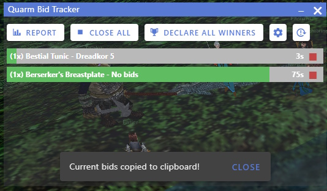

# Bid Tracker for Everquest - Project Quarm

This program is designed to manage DKP auctions for items in Everquest on the Project Quarm Emulation server.

## Getting Started

This application is designed to be run by anyone in the raid. You can use it to keep track of which items are being bid out and who the current highest bidder is. Anyone using this app is welcome to start, close, or declare winners for auctions.

The app works by using Zeal to detect specific types of guild messages to manage and place bids. The app sits on top of all other applications and is intended to sit on top of Everquest while you are playing.

Getting started is easy, just follow these instructions:

- [Download and install the latest version of Zeal](https://github.com/iamclint/Zeal)
- [Download and install this application](https://github.com/awhitedev/quarm-bid-tracker/releases/latest)
- Run the application
- Run Everquest
- Recommended: change your default chat channel to Guild so its easier to copy and paste the messages this app generates.

### Starting Auctions

Anyone can start an auction for an item. Just type the following message in guild chat: `start bids <item_link>` where `<item_link>` is an in-game link to the item being bid out.

You may bid out multiple items at the same time by separating each link with a `,` or `|`. Example: `start bids <item_link>, <item_link>`.

Please note:

- This application only tracks bids when the bid starts. If you start bids on one item and then 30 seconds later start a bid for the same item, the application will not retroactively look at all previous bids to find the next highest bid. Players are expected to bid again as if it is a new bid. It is recommended to start bids for multiple items as close together as possible.

### Closing Auctions

Anyone can close an auction for an item. You should ideally only do this once the timer has run down to 0 seconds. Type the following message in guild chat to close an auction: `bids closed <item_link>` where `<item_link>` is an in-game link to an item currently being auctioned.

You may close multiple auctions at the same time by separating each link with a `,` or `|`. Example: `bids closed <item_link>, <item_link>`

You can click the "Close All" button to copy a message to your clipboard to close all bids for active auctions. You can also click the stop sign icon next to an active auction copy a close message for just 1 item. Pasting this message into guild chat will close the auction(s).

If an auction is closed, and nobody bid on the item, the auction will be automatically removed from the tracker after 10 seconds.

Please note:

- Bids do not automatically close when the timer reaches 0 seconds.
- Closing an auction for an item stops all bidding for that item, even if there were multiple copies of that item.

### Declaring Winners

After a bid has been closed, the winning bids are displayed in the application. It's important to announce who the winners are in guild chat for multiple reasons:

1. The person who won knows they can loot their item.
2. The application can stop tracking the auction.
3. The aplication can post the winning bid to Discord (if configured)

To declare a winner you can click on the "Declare All Winners" button to copy a message to your clipboard to do this for all closed auctions with winning bids. You can also click the trophy icon next to a closed auction to copy a declaration message for just 1 item. Pasting this message into guild chat will declare the winning bids to the guild.

Announcing the winners of an auction will automatically remove the item from the tracker after 10 seconds.

### Placing Bids

After an auction starts for an item you may place a bid for that item by typing a message in guild chat in the following format: `<item_link> <bid_amount>`. If your bid is the highest bid, you will win the item after bids close. Example: `Mithril Vambraces 1` will bid 1 DKP on Mithril Vambraces.

Please note:

- Players will only be able to bid on one copy of an item even if there are multiple available.
- This application ONLY tracks bids that are placed in guild chat.
- This application will not work with links from PQDI. You must use in-game links for items only.
- The timer will reset to 30 seconds if you place a bid on an item with less than 20 seconds left.
- The app does not currently support bid priority for things like epics, quests, mains, and alts. Expectations for items like this will need to be set with the guild in voice comms or in guild chat separately. Do not bid unless you intend to spend the DKP and win the item.
- It is each person's responsibility to ensure they have enough DKP to bid on an item. This application will NOT keep track of how much DKP you have available to spend.

### Generating an Auction Report

Auction reports are a nice way for people to be reminded of all active auctions, how much time is left, and who the current winners are. You can click the "Report" button to generate a report and copy it to your clipboard so you can paste it into guild chat.

### Canceling Bids

Sometimes a player may accidentally place a bid on the wrong item or mistype the amount they intended to bid. When this happens the player may cancel all of their existing bids by typing the following message in guild chat: `cancel bid <item_link>`.

Bid administrators may cancel bids for other players by appending a colon and the player's name at the end of cancellation message (in guild chat). Example: `cancel bid <item_link>: <player_name>`

### Discord Integration

This application supports an integration with Discord web hooks. You can configure a webhook URL by clicking the gear icon in the app, providing the URL from Discord, and clicking Save. When a winning bid is delcared (see above) the winning bid will be posted to the channel associated with the Discord web hook URL.

### Application Shortcuts

The application supports the following keyboard shortcuts:

- `CTRL+ALT+Z` - Generates an auction report and copies it to your clipboard.
- `CTRL+ALT+X` - Generates a close all auctions message and copies it to your clipboard.
- `CTRL+ALT+C` - Generates a declare all winners message for closed auctions and copies it to your clipboard.
